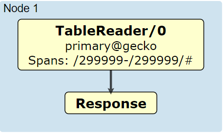
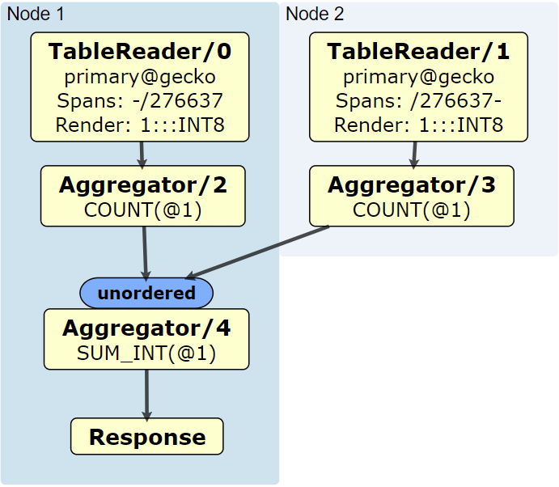
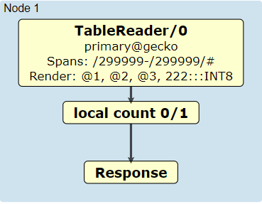
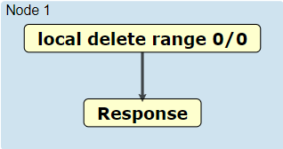
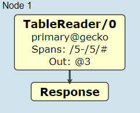
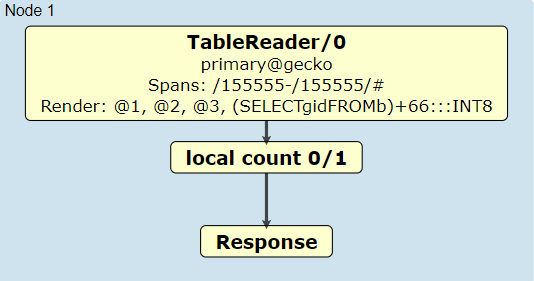
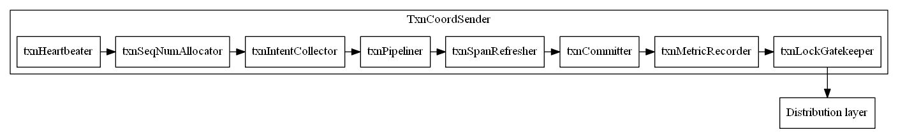

****************
rockroachDB简述
****************

Preliminary
===========

CRDB是什么
----------

|   CockroacbDB致力于同时提供scalability和strong consistency，支持SQL(pgwire)的同时解决关系型数据库在cloud native下的相关问题。
|   CockroachDB源于google spanner.

Spanner和TrueTime
-------------------

|   与CockroachDB相比，Spanner除上述特性外，是首个提供支持外部一致性(external-consistency)分布式事务的数据库。
|   Spanner通过TrueTime实现external-consistency.   
|   通过调用TrueTime API: TT.now(), 返回TTinterval: [earliest, latest]代表了uncertainty的上下界，取决于时钟漂移(clock-drift)的最差预估。

.. code::

                         +  
       +----------------+| 
       |to commit Txn A || must wait until
       +----------------+| TT.after(latest) 
       ^                ^| before commit
       |                ||
       <--uncertainty -->|
       +                +|
    earliest          latest

假设有无关事务A(node1)与B(node2), Alice在终端提交A并在时间t1提交成功，Bob观测到A被成功提交后立即提交B:

.. code::

                      t1           t2
                      +            +
     +--------------+ |            |
     |     TxnA     | |            |
     +--------------+ |            |
     |              | |            |
    t1e            t1l|            |
      \    7ms    /   |            |
       uncertainty    |            |
                      |            |
                   +--+-----------++
                   |     TxnB     |
                   +--------------+
                   |              |
                  t2e            t2l
                    \    7ms    /
                     uncertainty
    通过commit wait,可以确保 t1l < t1 < t2l < t2

|   TrueTime的局限性在于特定的环境依赖(如GCE),造成verdor lock-in.
|   没有TrueTime的支持，时钟漂移通常会达到百毫秒级别，CRDB不能使用commit wait.若A, B被提交至所在节点的本地时间分别为tn1和tn2, 且tn2 < tn1. 可以观察到 B HappensBefore A 的异常(anomaly).
|   因此，CRDB的一致性模型弱于external-consistency(linearizability),但达到了serializability, 即txn并不对外立即可见，对外可见后，所有观测者可以得到一致的顺序。

    CRDB使用HLC(hybird-logical clock)解决两个问题：

    1. 定义事务的因果和排序

    2. 使逻辑时钟与walltime的偏差收敛
    
    详细请看 `HLC paper <http://www.cse.buffalo.edu/tech-reports/2014-04.pdf>`_ .

Overview
========

.. figure:: images/sql-overview.png

   sql overview (来源: pathToCockroachSrc/src/github.com/cockroachdb/cockroach/docs/tech-notes/sql/sql-overview.png)

上图展示了SQL执行的流程，涵盖了CRDB的5个layer：

1. `SQL <https://www.cockroachlabs.com/docs/stable/architecture/sql-layer.html>`_ 解析SQL，并生成可执行的flow
2. `Transactional <https://www.cockroachlabs.com/docs/stable/architecture/transaction-layer.html>`_ 确保transaction的ACID特性
3. `Distribution <https://www.cockroachlabs.com/docs/stable/architecture/distribution-layer.html>`_ 为每个节点提供storage的kv抽象层(通过distAPI使数据对上层提供整体性视图)
4. `Replication <https://www.cockroachlabs.com/docs/stable/architecture/replication-layer.html>`_ 维护各个节点replicas, 提供高可用性和伸缩性
5. `Storage <https://www.cockroachlabs.com/docs/stable/architecture/storage-layer.html>`_ 基于RocksDB, 用于数据、元数据和辅助数据的读写

重要概念
=========

- Range
    CRDB切分数据的基本单元。Range的大小维持在一个区间，默认为16MB~64MB。达到上限将触发split; 反之，则触发merge.
    Range同样是replica的基本单元，Range的多份replicas中有且仅有一个Leaseholder.
    Range中的行按升序排列。

- Leaseholder
    负责处理对应Range的所有Read和Write操作。
    对于Read操作，无需经过raft直接从MVCC读取对应版本。因此，成为Leaseholder的node必须是in-sync的。
    对于Write操作，则需通过raft进行协调。
    Leaseholder并不等同于raft leader, 但通常他们是共栖的(colocated), 这样可以降低非必要的通信开销。

- Raft Leader & Raft log
    参考 `etcd notes <../etcd/etcd.rst>`_

- Span
    表示[startKey, endKey)范围内的所有key, Span可以跨越任意Ranges.

.. _Transaction Conflict:

- Transaction Conflict
    有如下情况：

    1. 发生于t1时txn1的read, 在mvcc中遇到t2执行的txn2所属value或intent, t1接近t2且t1 < t2, 由于clock skew，该read被认为发生在uncertainty window, 返回ReadWithinUncertaintyIntervalError.
    2. 发生于t1时txn1的read, 在mvcc中遇到t0执行的txn2的intent, 且t1 > t0. 返回WriteIntentError.
    3. txn1中的write, 在mvcc中遇到属于未提交txn2的intents. 返回WriteIntentError.
    4. 发生于t1时txn1的write, 遇到t2提交的tnx2所属value，且t1 < t2. 返回WriteTooOldError.
    5. 发生于t1时txn1的write, 遇到t2时执行的txn2所属read，且t1 < t2. 返回TransactionRetryError(reason=RETRY_SERIALIZABLE).

子系统
========

closed timestamp
----------------

用于实现follower read功能( `AS OF SYSTEM TIME <https://www.cockroachlabs.com/docs/v19.1/as-of-system-time.html#select-historical-data-time-travel>`_)
若满足：对于read请求时间ts, closedts >= ts, 那么read可以在follower节点完成。

.. code::

        closed           next
          |          left | right
          |               |
          |               |
          v               v
    ---------------------------------------------------------> time
    图摘自tracker.go

cockroach周期性地尝试close next, 时间轴被分为三个区域：

1. (-∞, closed] : closed之前的状态immutable.
2. (closed, next]: left sets中包含next之前提交的proposal, 该集合不能添加新proposal
3. (next, ∞]: right sets中包含next之后提交的proposal, 可以添加新proposal

latch manager
-------------

每个range replica包含lgmanager, 内部使用interval-btree维护行锁和区间锁，使用多个btree区分读写锁。

锁的临界区包含：

- Timestamp Cache的读写
    Timestamp Cache同样以区间的形式维护

- MVCC的写入
    写入values(non-transaction或1PC)、intents(2PC)

- raft log finish application

latch manager使用copy-on-write提高自身并发访问性能，区间锁的获取过程如下：

1. manager.Lock
2. 拷贝一份btree, 作为snapshot返回
3. 插入自己要访问的一组锁lg(下一个请求需要acquire snapshot和lg的并集)
4. manager.Unlock
5. 对于snapshot和lg的overlaps, 阻塞等待直至overlaps都被释放。

timestamp Cache
---------------

tsCache内部同样区分读写cache, 它们对应的范围：

- rCache对应：
   - GetRequest, ScanRequest等读操作
   - ConditionalPutRequest, InitPutRequest, IncrementRequest等CAS操作
   - RefreshRequest, RefreshRangeRequest(作用于读操作)
   - PushTxnRequest(read/write conflict, push timestamp)

- wCache
   - 由于MVCC存放了timestamp信息，写操作不会更新tsCache. DeleteRangeRequest是个例外, 因为在key不存在的情况下并不会在MVCC中写入tombstone(考虑[0, ∞)会产生无数个墓碑)
   - RefreshRequest, RefreshRangeRequest(作用于写操作，即DeleteRangeRequest)
   - EndTransactionRequest
   - PushTxnRequest(write/write conflict, push abort)

|   TsCache的实现有skiplist, btree和llrbtree, 与latch manager区别在于cache中的区间相互没有overlap. 
|   TsCache存放在内存, 因此cache设置了low water mark 限制item数量，之前的timestamp不会放入cache, 通过FIFO或LRU进行evict过量的timestamp.

Transaction timestamp
-----------------------

.. _Transaction timestamp:

CockroacbDB在Trasaction中定义了以下时间戳：

.. code::

    type Transaction struct {
      
      // 由gateway node分配，OrigTimestamp = hlc.Clock.Now()
      OrigTimestamp hlc.Timestamp

      // MaxTimestamp = OrigTimestamp + clock skew
      // 用于定义初始的uncertainty window = [OrigTimestamp, MaxTimestamp)
      MaxTimestamp hlc.Timestamp

      // 由于transaction conflict
      // 会尝试在server侧挑选一个合适的timestamp重试，即RefreshedTimestamp
      RefreshedTimestamp hlc.Timestamp

      // Transaction计划使用的提交时间
      // 会因为各种原因被forward, 如closedts, tscache或read push
      // 被push后，Transaction计划使用的提交时间需要retry(RETRY_SERIALIZABLE)
      Timestamp hlc.Timestamp

      // Transaction被各节点observed的时间，用于缩小uncertainty window
      ObservedTimestamps []ObservedTimestamp

    }

Transaction queue
-----------------

|   \ `Transaction Conflict`_\ 中的情况②与③会在当前节点触发push.
|   发送PushTxnRequest尝试push timestamp(read/write)或push abort(write/write)所遭遇intents所属的txn.
|   若因为pusher priority <= pushee priority等原因push失败，pushee进入TxnQueue.
|   pusher进入select loop, 同时追踪(poll)pusher和pushee的状态，等待pushee进入COMMITTED, ABORTED, EXPIRED或与pusher形成死锁。
|   如果形成死锁，具有更高priority的一方使用force push杀死另一方。
|   其他情况下发送resolveIntentRequest确保intents都resolved. 再尝试commit或retry.

Transaction之旅
================

**跟随transaction漫游CRDB的实现**

准备工作
---------

- 从源码安装CockroachDB：

.. code::

    wget -qO- https://binaries.cockroachdb.com/cockroach-v19.1.1.src.tgz | tar  xvz
    cd cockroach-v19.1.1 && make build
    # binary文件在 ./src/github.com/cockroachdb/cockroach/cockroach

- 配置一组CRDB cluster：

1. 在IDE中启动第一个node,启动参数如下：
    - Environment: COCKROACH_DISTSQL_LOG_PLAN=true  (设置该参数可输出SQL执行计划URL)
    - Arguments: start --insecure --listen-addr=192.168.1.101:26257 --logtostderr=INFO
2. 增加两个node：

.. code::

    cd pathToCockroachSrc/src/github.com/cockroachdb/cockroach
    # 使用 --join=XXX 加入现有cluster
    ./cockroach start --insecure --listen-addr=192.168.1.102:26257 --http-addr=192.168.1.102:8080 --store=node2 --join=192.168.1.101:26257
    ./cockroach start --insecure --listen-addr=192.168.1.102:26258 --http-addr=192.168.1.102:8081 --store=node3 --join=192.168.1.101:26257

访问任意节点gui可查看cluster状态，例：http://192.168.1.101:8080

- 建表并populate一定量数据：

.. code::

    # 使用同一binary文件连接至node
    ./cockroach sql --insecure --host=192.168.1.101:26257
    create database bihu;
    use bihu;
    create table gecko (key int primary key, value varchar(1000), gid int);
    # 写入一定量数据，省略...
    # 可以通过experimental_ranges命令观察到数据分裂成为多个ranges
    show experimental_ranges from table gecko; 
      start_key | end_key | range_id | replicas | lease_holder
    +-----------+---------+----------+----------+--------------+
      NULL      | /112821 |       62 | {1,2,3}  |            2
      /112821   | /225420 |       72 | {1,2,3}  |            1
      /225420   | NULL    |       73 | {1,2,3}  |            3

Connection
----------

.. code::
    
               +------------------+
               | reader goroutine |
               +------------------+
                                  |
                                  |
                                  v
    +-----------------------------+
    |           stmtBuf           |
    +-+---------------------------+
      ^
      |
      |
     ++--------------------+
     | processor goroutine |
     +---------------------+

对于每个client connection
    1. server使用一个reader goroutine读取client端发送的statement, 放入stmtBuf.
    2. 另一个processor goroutine依次执行stmtBuf中的statement

SQL layer
---------

SQL layer解析statement为AST nodes, planner分析nodes生成优化后的logicalPlan和physicalPlan.
由于设置了COCKROACH_DISTSQL_LOG_PLAN=true与--logtostderr=INFO, 执行计划会输出在终端，例：

.. code::

    select * from gecko where key=299999;
    // 输出 https://cockroachdb.github.io/distsqlplan/decode.html#eJyMT7FKBDEU7P0KGdvI7tqZyvYaldNOtojJsCzu5YW8LChH_l12I4iFcGnCzLw3M--MKIGP7kSFfcOA0SBl8VSVvFFt4BA-YXuDOaa1bPRo4CUT9owyl4WweHXvC490gbnrYRBY3LzstinPJ5e_Hib6D4HBS3JR7XV3d7-925-_u8FYDWQtvyFa3ETYoZrLixypSaLyT4f_nPs6GjBMbMeqrNnzOYvfYxp82vd2IlBLU4cGDrFJdaxX3wEAAP__epRsmg==

将url输入浏览器，得到：

    简单查询

更多例子：

.. code::

    select count(1) from gecko;

    使用分布式查询

**需要说明的是，只有ReadOnly操作才会分派到其他节点执行**

.. code::

    update gecko set gid = 222 where key = 299999;

    更新记录

|   可以观察到，尽管statement只更新了一个字段，但是整行记录都被读取到gateway node.
|   这是因为Storage layer的实现是rocksDB, API基于key(主键)-value(其他所有字段)，所有操作粒度都是基于行。
|   由此可见，CRDB并不适用于大批量更新操作的场景(例：每行更新少量字段)

.. code::

    delete from gecko where key in (3, 299998);

    指定主键的delete是个例外，使用了DeleteRange

使用DeleteRange的条件：

.. code:: 

    func (b *Builder) canUseDeleteRange(del *memo.DeleteExpr) bool {
      // delete 语句使用了RETURING返回删除的结果
      if del.NeedResults() {
      	return false
      }
      tab := b.mem.Metadata().Table(del.Table)
      if tab.DeletableIndexCount() > 1 {
      	// 使用了第二索引
      	return false
      }
      if tab.IsInterleaved() {
      	// 使用了INTERLEAVE IN PARENT, INTERLEAVE 将子表记录插入父表Range, 提升join与cascade性能
      	return false
      }
      if tab.IsReferenced() {
      	// 作为外键被引用
      	return false
      }
      // 使用了limit或其他原因
      if scan, ok := del.Input.(*memo.ScanExpr); !ok || scan.HardLimit != 0 {
      	return false
      }
      return true
    }

statement可能生成多个root plan node:

.. code:: 

    // 从句
    with b as(select gid from gecko where key=5) update gecko set gid = (select gid from b)+66 where key=155555;

    先执行从句

    从句的输出作为主句输入

Transactional layer
-------------------

    rootTxn的Transaction layer

1. txnHeartbeater: 针对slow query, 确认transaction的liveness

.. _txnSeqNumAllocator:

2. **txnSeqNumAllocator**: 分配给每一个write唯一的序列号，read操作的序号和最近的write有相同序列号

3. txnIntentCollector: EndTransactionRequest执行时，将transaction中所有write intents附着，确保提交时都resolved

4. txnPipeliner: 用于追踪开启pipelinedWritesEnabled(未开启)选项后，确保后续重叠操作和提交前asyncConsensus都已完成(通过附加QueryIntentRequest)

.. _MindTheGap:

5. **txnSpanRefresher**: 实现transaction的auto-retry
    - 针对 \ `Transaction Conflict`_\ 的情况 ①, ④, ⑤ downstream layer返回错误的同时，附带一枚可以refresh的timestamp, transaction将其作为RefreshedTimestamp去尝试refresh, 仅仅重试当前batch.
    - 截止该失败操作前的每一个refreshable spans(GetRequest, ScanRequest或DeletaRangeRequest等), 发送 RefreshRequest/RefreshRangeRequest. 
    
    .. code::

        Orig     refresh1    refresh2    refresh3
          +          +          +           +
          |          |          |           |
          |          |          |           |
          |          |          |           |
          |          |          |           |
          v          v          v           v
          +----------+----------+-----------+-------+
          |              Scan request               |
          +-----------------------------------------+
          +---------->---------->----------->
            refresh1   refresh2    refresh3
        
        
          +-----------------------------------------+
          |              Put  request               |
          +-----------------------------------------+
          +---------->                     /
               4      \                   /
                       -- mind the gap ---
        
          +-----------------------------------------+
          |              Scan request               |
          +-----------------------------------------+
                     +---------->----------->
                          1        refresh3
        
        
          +-----------------------------------------+
          |              Put  request               |
          +-----------------------------------------+
                                +----------->
                                      5
    
    - 如果refresh未成功，那么retry旧不可避免。
        
6. txnCommitter: 目前尚未完成

7. txnMetricRecorder: metrics相关

8. txnLockGatekeeper: 确保所有interceptor在持有锁的情况下执行

Distribution layer
------------------

.. code::

                                                                    +--------------------------+
                                                                    |meta        +---------+   |
                                                                    |            | +-----+ |   |
                                                                    |        +---> |meta2| |   |
                                                                    |        |   | +-----+ |   |
                                                                    | +------+   |  node1  |   |
                                                                    | | meta1|   | +-----+ |   |
                           +--------------------+                   | +----------> |meta2| |   |
                           |                    |  lookup ranges    |            | +-----+ |   |
                           |     DistSender     +------------------>+            +---------+   |
                           |                    |                   |            | +-----+ |   |
                           +--------+------+----+                   | +----------> |meta2| |   |
                                    |      |                        | | meta1|   | +-----+ |   |
                                    |  d   |                        | +------+   |  node2  |   |
                                    |  i   |                        |        |   | +-----+ |   |
                                    |  s   |                        |        +---> |meta2| |   |
                                    |  p   |                        |            | +-----+ |   |
                                    |  a   |                        |            +---------+   |
                                    |  t   |                        |                          |
                                    |  c   |                        +--------------------------+
                     +--------------+  h   +-------------------+
    +-----------------------------------+     +-----------------------------------+
    |                |                  |     |                |                  |
    |    +-----------v------------+     |     |    +-----------v------------+     |
    |    |        stores          |     |     |    |        stores          |     |
    |    ++-----+-----+-----+-----+     |     |    ++-----+-----+-----+-----+     |
    |     |     |     |     |     |     |     |     |     |     |     |     |     |
    |   +-v-+ +-v-+ +-v-+ +-v-+ +-v-+   |     |   +-v-+ +-v-+ +-v-+ +-v-+ +-v-+   |
    |   | r | | r | | r | | r | | r |   |     |   | r | | r | | r | | r | | r |   |
    |   | a | | a | | a | | a | | a |   |     |   | a | | a | | a | | a | | a |   |
    |   | n | | n | | n | | n | | n |   |     |   | n | | n | | n | | n | | n |   |
    |   | g | | g | | g | | g | | g |   |     |   | g | | g | | g | | g | | g |   |
    |   | e | | e | | e | | e | | e |   |     |   | e | | e | | e | | e | | e |   |
    |   +-+-+ +-+-+ +-+-+ +-+-+ +-+-+   |     |   +-+-+ +-+-+ +-+-+ +-+-+ +-+-+   |
    |     |     |     |     |     |     |     |     |     |     |     |     |     |
    |     v     v     v     v     v     |     |     v     v     v     v     v     |
    |   +-+-----+-----+-----+-----+-+   |     |   +-+-----+-----+-----+-----+-+   |
    |   |       rocksdb mvcc        |   |     |   |       rocksdb mvcc        |   |
    |   +---------------------------+   |     |   +---------------------------+   |
    +-----------------------------------+     +-----------------------------------+

|   CRDB通过Meta Range定位数据存放节点。
|   Meta Range为二级索引结构，分为meta1和meta2. 每个节点拥有完整的meta1.
|   meta2分布于所有节点。
|   详见 `Meta range <https://www.cockroachlabs.com/docs/stable/architecture/transaction-layer.html>`_
|   位于相同node的所有操作组成batch发送到对应节点。

.. code::

    Orig                       Max                                                             
      +                         +                                                              
      |                         |                                                              
      |    Orig + clock skew    |                                                              
      |                         |                                                              
      v                         v                                                              
      +-------------------------+                                                              
      |                         |                                                              
      |       ScanRequest       |                                                                                   
      |                         |                                                                                   
      +-------------------------+                                
      |                 /^                                                                                          
       \               / |                                                 
        \             /  |                                                                                          
         \  actual   /   +                                  
         uncertainty     Observed by node                       
            window   

BatchRequest到达所属node后，node记录接收batch的时间，减少uncertainty window： \ `Transaction timestamp`_\

根据操作keyRange所属rangeDescriptor, node再派发给各个range replica.

只读操作比较简单，不包含raft log写入：

.. code::

                            +a
                            |c R
                            |q l
                            |u o
                            |i c
                            |r k
                            |e
    +------------------------------------------------+
    | latches               |                        |
    |                       |                        |
    |                       v                        |
    |          +------------+------------+           |
    |          |                         |           |
    |          |   access MVCC storage   |           |
    |          |                         |           |
    |          +------------+------------+           |
    |                       |                        |
    |                       |                        |
    |                       |                        |
    |                       v                        |
    |          +------------+------------+           |
    |          |                         |           |
    |          | update timestamp rcache |           |
    |          |                         |           |
    |          +------------+------------+           |
    |                       |                        |
    |                       v                        |
    +------------------------------------------------+
    executeReadOnlyBatch    |r
                            |e R
                            |l l
                            |e o
                            |a c
                            |s k
                            |e
                            v

包含写操作的Batch需要访问closedts, tscache查看是否需要refresh, 并apply raft log:

.. code::

                               +a
                               |c
                               |q l
                               |u o
                               |i c
                               |r k
                               |e
       +-----------------------------------------------+
       | latches               |                       |
       |                       |                       |
       |          +------------v-----------+           |
       |          |     get minTS from     +-------------+
       |          |        closedts        |           | |
       |          +------------------------+           | |
       |                       |                       | |
       |                       |                       | |                +------------------+
       |          +------------v-----------+           | v pushed         |   need refresh   |
       |          | apply timestampcache   +----------------------------->+     or retry     |
       |          +------------------------+           | ^                |   must use 2pc   |
       |                       |                       | |                +------------------+
       |                       |                       | |
       |          +------------v-----------+ tooOld    | |
       |          |  access MVCC storage   +-------------+
       |          +------------------------+           |
       |                       |                       |
       |                       |                       |
       |          +------------v-----------+           |
       |          |     submit propose     |           |
       |          |           &&           |           |
       |          |  wait for application  |           |
       |          +------------------------+           |
       |                       |                       |
       |                       |                       |
       |          +------------v-----------+           |
       |          | update timestamp rcache|           |
       |          +------------------------+           |
       |                       |                       |
       |                       |                       |
       |                       |                       |
       +-----------------------------------------------+
       executeReadOnlyBatch    |r
                               |e
                               |l l
                               |e o
                               |a c
                               |s k
                               |e
                               v

CRDB对于implicit transaction进行了1PC优化，只要满足下列条件：

.. code::

  func isOnePhaseCommit(ba roachpb.BatchRequest, knobs *StoreTestingKnobs) bool {
    if ba.Txn == nil {
      return false
    }
    if !ba.IsCompleteTransaction() {
      return false
    }
    arg, _ := ba.GetArg(roachpb.EndTransaction)
    etArg := arg.(*roachpb.EndTransactionRequest)
    if batcheval.IsEndTransactionExceedingDeadline(ba.Txn.Timestamp, *etArg) {
      return false
    }
    if retry, _, _ := batcheval.IsEndTransactionTriggeringRetryError(ba.Txn, *etArg); retry {
      return false
    }
    return !knobs.DisableOptional1PC || etArg.Require1PC
  }

1. 包含EndTransactionRequest, 且 \ `txnSeqNumAllocator`_\所分配的所有序列号都在该batch, 即所有写操作分布在同一Range
2. Txn还没有过期(默认4分钟)
3. Txn从未retry, 这意味着 txn.OrigTimestamp == txn.Timestamp
4. 没有显式关闭优化(默认开启)

1PC没有commit阶段，没有intents，不需要维护txnMeta, 大大提高了效率。以下是一些示例：

.. code::

    // X 使用了显式transaction, batch不包含EndTransactionRequest, 即使一次性将transaction完整发送。
    begin; update gecko set gid = 999 where key=166666; commit;

    // X 5和166666不在同一Range
    update gecko set gid = 999 where key in (5, 166666);

    // √ 尽管使用subquery会生成同步的两阶段plan, 且8和499999不在同一node. 但写操作仅仅只有499999
    with a as (select gid from gecko where key=8) update gecko set gid=(select gid from a) where key = 499999;

**Commit阶段**

未能满足1PC的Transaction必须进行Commit：

1. 确保所有writeIntents resolved, 比如 \ `MindTheGap`_\中， PutRequest需要forward到txn.Timestamp在MVCC中检查是否存在冲突
2. 确保未被push abort.
3. 确保Txn.Timestamp == lastRefreshedTimestamp(如果refresh未发生过，即 OrigTimestamp). closedts, tsCache和push timestamp都会导致Txn.Timestamp > lastRefreshedTimestamp, 这种情况下必须retry

关于retry
----------

1. Auto-retry, 适用的情况是： implicit tranasction或一次性发送完整transaction
2. client-side-retry：如果任意读操作的结果泄露给客户端，那么auto-retry不可能再满足serializable一致性，返回 40001 / "retry transaction" 给客户端。

Storage layer
-------------

CRDB的存储使用了基于RocksDB的MVCC