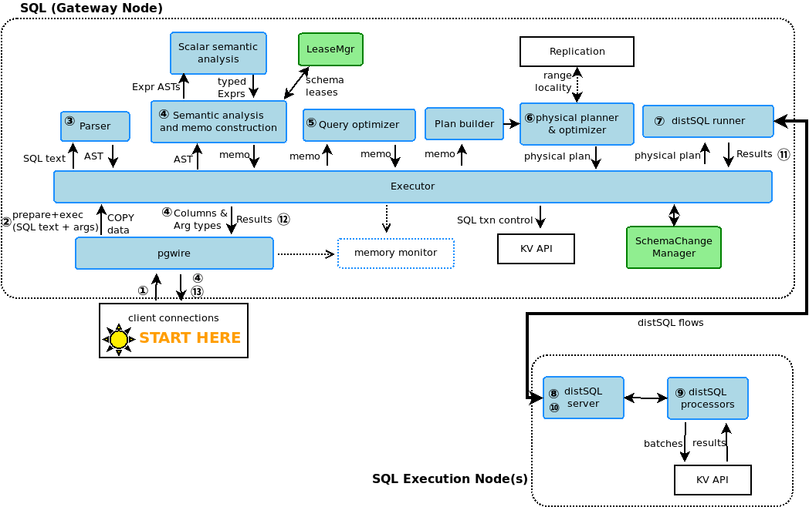

****************
rockroachDB简述
****************

Preliminary
===========

CRDB是什么
----------

    CockroacbDB致力于同时提供scalability和strong consistency，支持SQL的同时解决关系型数据库在cloud native下的相关问题。
    CockroachDB源于google spanner.

Spanner和TrueTime
-------------------

    与CockroachDB相比，Spanner除上述特性外，是首个提供支持外部一致性(external-consistency)分布式事务的数据库。
    Spanner通过TrueTime实现external-consistency.   
    通过调用TrueTime API: TT.now(), 返回TTinterval: [earliest, latest]代表了uncertainty的上下界，取决于时钟漂移(clock-drift)的最差预估。

.. code::

                         +  
       +----------------+| 
       |to commit Txn A || must wait until
       +----------------+| TT.after(latest) 
       ^                ^| before commit
       |                ||
       <--uncertainty -->|
       +                +|
    earliest          latest

假设有无关事务A(node1)与B(node2), Alice于终端提交A并在时间t1提交成功，Bob观测到A成功提交后立即提交B:

.. code::

                      t1           t2
                      +            +
     +--------------+ |            |
     |     TxnA     | |            |
     +--------------+ |            |
     |              | |            |
    t1e            t1l|            |
      \    7ms    /   |            |
       uncertainty    |            |
                      |            |
                   +--+-----------++
                   |     TxnB     |
                   +--------------+
                   |              |
                  t2e            t2l
                    \    7ms    /
                     uncertainty
    通过commit wait,可以确保 t1l < t1 < t2l < t2

TrueTime的局限性在于特定的环境依赖(如GCE),造成verdor lock-in.
没有TrueTime的支持，时钟漂移通常会达到百毫秒级别，CRDB不能使用commit wait.若A, B被提交至所在节点的本地时间分别为tn1和tn2, 且tn2 < tn1. 可以观察到 B HappensBefore A 的异常(anomaly).
因此，CRDB的一致性模型弱于external-consistency(linearizability),但达到了serializability, 即txn并不对外立即可见，对外可见后，所有观测者可以得到一致的顺序。
CRDB使用HLC(hybird-logical clock)管理排序和因果问题。详细请看 `HLC paper <http://www.cse.buffalo.edu/tech-reports/2014-04.pdf>`_ 

Overview
========

   图1:sql overview (来源: pathToCockroachSrc/src/github.com/cockroachdb/cockroach/docs/tech-notes/sql/sql-overview.png)

图1展示了SQL执行的流程，涵盖了CRDB的5个layer：

1. `SQL <https://www.cockroachlabs.com/docs/stable/architecture/sql-layer.html>`_ 解析SQL，并生成可执行的flow
2. `Transactional <https://www.cockroachlabs.com/docs/stable/architecture/transaction-layer.html>`_ 确保transaction的ACID特性
3. `Distribution <https://www.cockroachlabs.com/docs/stable/architecture/distribution-layer.html>`_ 为每个节点提供storage的kv抽象层(通过distAPI使数据对上层提供整体性视图)
4. `Replication <https://www.cockroachlabs.com/docs/stable/architecture/replication-layer.html>`_ 维护各个节点replicas, 提供高可用性和伸缩性
5. `Storage <https://www.cockroachlabs.com/docs/stable/architecture/storage-layer.html>`_ 基于RocksDB, 用于数据、元数据和辅助数据的读写

Transaction之旅
================

**跟随transaction漫游CRDB的实现**

准备工作
---------

