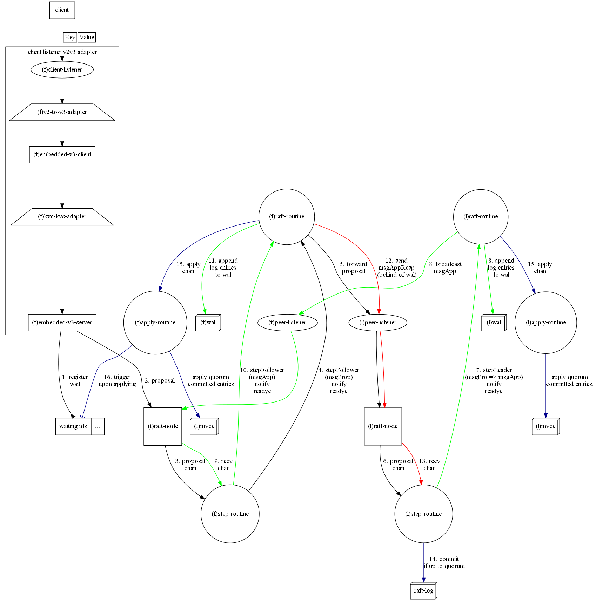
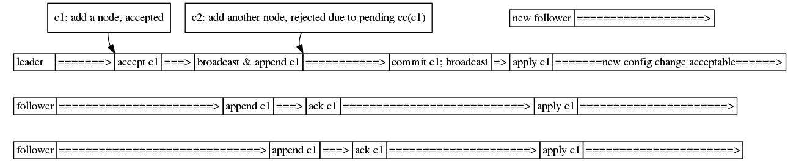

**************
etcd 学习笔记
**************

关于etcd
========
etcd是Raft一致性算法的一种基于golang的实现。

本文基于版本3.3.X, v3 api

官方github：`etcd-io/etcd <https://github.com/etcd-io/etcd>`_

Raft一致性算法论文： [1]_

etcd目标
--------

* 通过强一致性、可靠性的KV store(**reliable capacity: several gigabytes**)，提供关键元数据存储。
* 提供分布式锁、选举等协调服务。

etcd的一致性guarantees
----------------------

* CAP语义下：发生网络分区时，etcd牺牲可用性确保一致性，属于CP模型。
* 一致性模型：所有操作遵循sequential consistency / serializability(txn).
* 只读操作：在默认配置下，额外提供linearizable read.

etcd提供的一致性仅弱于linearizability / strict serializability. 在实践中，Google Spanner达到了strict serializability(也称为external consistency).

Raft算法guarantees
------------------

.. _Election Safety:

* **Election Safety**: 同一任期只能有一个leader当选

.. _Leader Append-Only: 

* **Leader Append-Only**: leader不会覆盖和删除既有日志条目；只能增加新条目

.. _Log Matching: 

* **Log Matching**: 如果两日志都包含一个具有相同index和term的条目，那么可以认为这两个日志从头到该条目为止是完全一致的

.. _Leader Completeness: 

* **Leader Completeness**: 如果一个日志条目在给定term被提交，那么这条日志一定会被包含在所有任期大于给定term的leader日志中

.. _State Machine Safety: 

* **State Machine Safety**: 如果某一server将一个日志条目apply到状态机中，那么其他server不会apply一个具有相同index的不同日志条目

以上摘自raft paper [1]_

etcd实现
========

消息流
------

   
   图1:用户通过client连接follower进行put操作

.. figure:: images/main-loop.png

   图2:三个routine通过channel推动raft状态机

raft状态机主要通过三个go routine推动：

#. step-routine: 位于raft/node.Node.run. Event loop, 接收并处理事件，并将包含的raft updates和待发msg放入mailbox(下一loop通过ready channel推送给raft-routine)

#. raft-routine: 位于etcdserver/raft.raftNode.start. 触发tick事件，从step-routine接收就绪的raft updates并持久化到wal，发送待发msgs到对应的peers，派发apply entries到apply-routine，并通过advance channel通知step-routine已完成处理

#. apply-routine: 位于etcdserver/server.EtcdServer.run. 接收raft-routine发送的apply entries，schedule apply到fifo队列中完成

**step-routine, raft-routine, apply-routine并非官方正式命名**

图1中的流程为：

#. follower接收client请求，通过对应API入口，异步注册wait(等待proposal成功apply到状态机)，并proposal到自身状态机(MsgProp -> stepFollower)

#. follower将MsgProp转发给当前leader

#. leader将MsgProp中的entries写入wal，并同时下发包含entries的MsgApp给所有follower

#. 所有follower将MsgApp中的entries写入wal，并通过MsgAppResp向leader报告

#. leader接收maintain所有members的progress，称为prs，当该条日志在quorum中被报告完成(条目index低于或等于quorum progress)，leader正式提交quorum progress之前的条目

#. leader将quorum committed index放入下一条MsgApp中向所有followers广播

#. follower根据MsgApp中的m.Commit, 将可执行的entries apply到状态机中，如果当前follower在已注册的wait中发现对应client请求，那么通知wait向client返回结果

- 由于任意时刻，只能有一个leader，确保了\ `Election Safety`_\，稍后在raft选举中重点提及

- 很显然，leader只会append新的条目到log，确保了\ `Leader Append-Only`_\

- 日志条目总是从唯一的leader流向followers，进而确保了\ `State Machine Safety`_\

- 仅当日志条目被写入quorum wal后，leader会提交该条目，确保了\ `Leader Completeness`_\。即使发生了network partition，日志完全的node才会在选举中获胜；任意满足quorum数量的节点中确保了完全日志的存在性

- 为了简便，图1中并没有体现异常情况的处理。follower接收MsgApp时，会检查是否满足\ `Log Matching`_\，若不满足，follower在M's'g'所有follower将MsgApp中的entries写入wal，并通过MsgAppResp拒绝写入。leader在follower拒绝后将其pr设为probe。如果log已经compaction，将向follower发送snapshot

以满足了这些guarantees为前提，就确保了状态机的安全性

etcd read
---------

- 如果在range request中将serializable设置为true(default false)，任意节点接受到请求后直接进行本地查询后返回结果

  * 相较于默认配置，性能有一定提升
  * 违背了一致性承诺，会有stale reads现象

- 默认情况下，官方声明read的一致性达到了linearizability. 在这种一致性模型下要求etcd对read操作在writes之间以realtime进行total ordering

  * range request被forwarding到leader后，leader会给request盖上当前的committedIndex
  
  * follower得到committedIndex后，会等待到follower appliedIndex >= committedIndex，即将leader给予的index条目应用的状态机

  * 得益于MVCC(key对应的value可以保存多个revision)与\ `Leader Append-Only`_\, follower可以在本地状态机查询一个静态的数据集，从而达成read linearizability

quorum维持与选举
----------------

- leader每隔heartbeatTimeout(tick)会广播heartbeat。若启用了checkQuorum选项，并且经过electionTimeout后active的node不足quorum, leader stepdown并重新进行选举。

- 若follower在randomizedElectionTimeout(r.randomizedElectionTimeout = r.electionTimeout + globalRand.Intn(r.electionTimeout))内没有收到heartbeat, follower会将自己作为candidate(增加term)并开始选举，使用随机timeout是为了防止选票分裂，造成cluster长期不可用

- 为了确保\ `Election Safety`_\，follower在每个Term只能投一次赞成票

   图3:3节点etcd cluster通信

#. 假设heartbeatTimeout为100ms, electionTimeout为500ms. 

#. node-3在tick2被隔离, 假设其初始randomizedElectionTimeout=600ms(为了简化图，取heartbeatTimeout整数倍)

#. 3节点cluster, quorum=2, majority仍能正常工作。600ms后，node-3自增term并重置randomizedElectionTimeout=900ms开始新选举，但不可能得到其他选票当选

#. 700ms后，网络分区恢复，下一tick node-3重新收到node-1的heartbeat消息，消息任期m.Term < node-3.Term，node-3将回复带有node-3.Term的MsgAppResp，这将会导致leader下台

#. leader接收到Term大于自己的MsgAppResp，leader下台成为follower

#. node-3 randomizedElectionTimeout先到期，开始新选举。node-1, node-2重置自己的follower状态,后然进行投票，由于不满足\ `Leader Completeness`_\，node-3被其他节点否决，重置自己的follower状态

#. 所有节点开始等待randomizedElectionTimeout。node-2抢先发起新选举，并赢得了选举，集群重回正轨

选举优化
--------

可以观察到，节点长期处于minority分区时, Term会迅速递增。网络分区恢复后，leader因收到比自己更高Term的MsgAppResp而下台进行重新选举。如果部分节点长期处于网络不稳定的状态，会对集群可用性造成比较大的影响，这种现象被称为干扰(disruption)

为了优化这个问题，etcd提供了PreVote选项：

.. figure:: images/prevote.png

   图4：启用prevote防止干扰

candidate并不增加Term, 而在选票上填写m.Term=Term+1, 新leader成功当选，接受m.Term

成员配置变更
------------

etcd支持在没有downtime的前提下执行成员变更(membership reconfiguration).
作为infrastructure, 这是极为重要的feature.

**成员数量变更时，需重新计算nquorum=member/2+1, 若当前active member未达到nquorum, etcd拒绝进行变更**

#. 对于添加成员，若当前active member未达到目标nquorum, etcd拒绝请求

#. 对于移除成员，若当前除目标外的active member未达到目标nquorum, etcd拒绝请求

**在配置过渡期，集群会比较脆弱，尤其成员数量为偶数时**

成员变更通常分为两个阶段，首先将配置变更提交到etcd cluster

- 增加一个新成员

   图5：请求添加新成员

#. leader先确认没有pending(即还未apply)的配置变更EntryConfChange，若存在则丢弃请求

#. 和常规proposal相似，在**nquorum**(图5中为3)都写入wal后，leader提交配置条目。client在node apply配置后得到同意的回复

#. 集群可以接收新的配置变更请求

- 删除成员的过程与之类似，那么删除当前leader自己呢？

   图6：删除当前leader

#. 配置未提交前，leader仍然管理集群，但不将自己视为nquorum的一员

#. 当配置apply后，leader退位

#. 当leader会阻塞一小段时间再退出集群，以防止干扰选举

当成员变更请求被批准后，用户可以通过指定--initial-cluster启动新成员，或停用移除的成员

Reference
=========

.. [1] `In Search of an Understandable Consensus Algorithm <https://ramcloud.atlassian.net/wiki/download/attachments/6586375/raft.pdf>`_